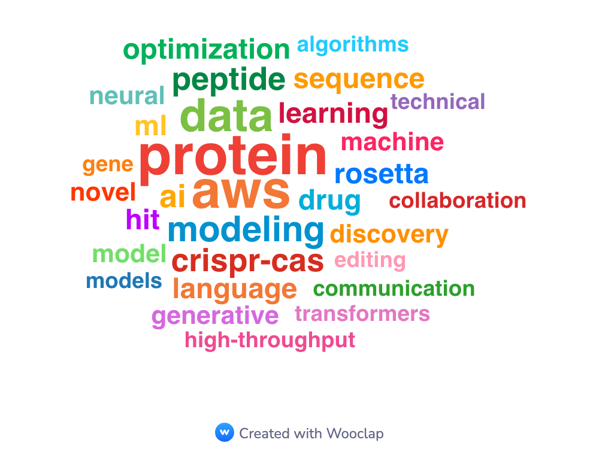

# Hi there, I'm Mohit Pandey 👋

Welcome to my GitHub profile! Here you'll find my projects, contributions, and a little about me.

---

## 🧑‍💻 About Me
As a Machine Learning Scientist with more than five years of experience in deep learning, optimization algorithms, and software engineering, I am passionate about using my skills to analyze high-throughput biological datasets. I have a strong Ph.D. training in Computational Statistical Physics and Biophysics, and subsequent experience in industry working on i) peptide and protein modeling and ii) CRISPR-Cas gene-editing medicine. I am eager to collaborate with others to bring the power of AI to drug discovery and improve patient outcomes.

       

---

- 🔭 I’m currently working on: **[Your Current Projects or Interests]**
- 🌱 I’m learning: **[Technologies/Skills You're Learning]**
- 💬 Ask me about: **[Your areas of expertise or interest]**
- 📫 How to reach me: **[Your email or social links]**
- ⚡ Fun fact: **[Something interesting about you!]**

---

## 📂 My Projects

- [Project 1](https://github.com/mohitpandey92/project1): Description of project 1.
- [Project 2](https://github.com/mohitpandey92/project2): Description of project 2.
- [Project 3](https://github.com/mohitpandey92/project3): Description of project 3.

*You can see more of my projects [here](https://github.com/mohitpandey92?tab=repositories).*

---

## 🤝 Let's Connect

)

---

> “I may not have gone where I intended to go, but I think I have ended up where I needed to be." -Douglas Adam
